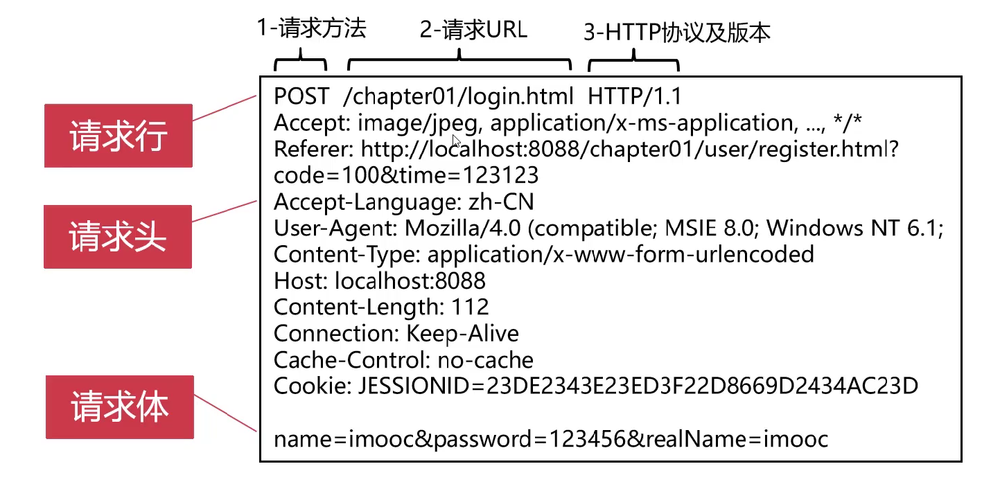
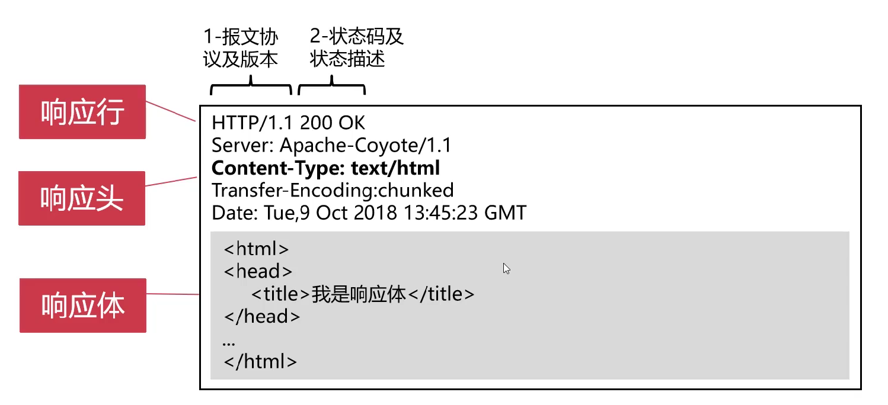

# Web基础与数据处理

## Java Web基础

### 请说明Servlet执行流程

因特网 -> Apche Tomcat -> web.xml -> FirshServlet

FirshServlet -> 用户


>Servlet默认情况下是第一次访问的时候实例化，也可以通过web.xml配置load-on-startup,使其在服务器启动的时候实例化。
---
>Tomcat全局中，有且仅有唯一的一个对象。
---
>Servlet在并发环境下，是**单例多线程**，在多线程下，所有线程共享一个Servlet实例，不允许创建存在状态的变量或对象，造成无法预期的结果。

- 补充
  - 在web.xml配置的多个servlet不是同一个对象，而是在多线程的访问的情况下，这个Servlet只有一个
  - 无状态对象(Stateless Bean)，就是没有实例变量的对象.不能保存数据，是不变类，是线程安全的。
  - 在  servlet里不是不可以new对象，在不考虑线程安全的情况下是可以new对象的，如果考虑到线程安全问题，不建议new对象

### Servlet生命周期

- 装载 - web.xml
- 创建 - 构造函数
  - Java层面
- 初始化 - init()
  - Servlet独有的资源的方法
- 提供服务 - service()
- 销毁 - destory()

### 请求与响应的结构

- HTTP请求包含三部分：请求行、请求头、请求体



- HTTP响应包含三部分，响应行、响应头、响应体



### 请求转发与响应重定向的区别

#### 请求转发

- 请求转发是**服务器跳转，只会产生一次请求**
- 请求转发使用的语句是：`request.getRequestDispatcher().forward()`

#### 响应重定向

- 重定向则是**浏览器端跳转，会产生两次请求**
- 响应重定向语句是：`response.sendRedirect()`

### 请阐述Session的原理

- 服务端，用户会话，存储用户信息


### JSP九大内置对象

|  内置对象   |              描述              |
| :---------: | :----------------------------: |
|   request   | 请求对象 - HttpServletRequest  |
|  response   | 响应对象 - HttpServletResponse |
|   session   |     用户会话 - HttpSession     |
| application | 应用全局对象 - ServletContext  |
|     out     |     输出对象 - PrintWriter     |
|    page     |      当前页面对象 - this       |
| pageContext |  页面上下文对象 - PageConetxt  |
|   config    |  应用配置对象 - ServletConfig  |
|  exception  |    应用异常对象 - Throwable    |

## 数据处理

### Statement和PreparedStatement的区别

- PreparedStatement是预编译的SQL语句，效率高于Statement
- PreparedStatement支持?操作符，相对于Statement更加灵活
- PreparedStatement可以防止SQL注入，安全性高于Statement

### 请说明JDBC使用步骤

- 加载JDBC驱动
- 创建数据库连接(Connection)
- 创建命令(Statement)
- 处理结果(ResultSet)
- 关闭连接

```Java
package com.imooc.interview.jdbc;

import java.sql.*;

public class MysqlJDBC {
    public static void main(String[] args) {

        String driverName = "com.mysql.jdbc.Driver";
        String URL = "jdbc:mysql://127.0.0.1:3306/scott";
        String sql = "SELECT * FROM emp";
        String username = "root";
        String password = "root";
        Connection conn = null;
        try {
            //1.加载JDBC驱动
            Class.forName(driverName);
            //2.建立连接
            conn = DriverManager.getConnection(URL, username, password);
            //3.创建命令（Statement)
            Statement ps = conn.createStatement();
            //4.处理结果
            ResultSet rs = ps.executeQuery(sql);
            while (rs.next()) {
                System.out.println(rs.getString("ename") + "," +
                        rs.getString("job") + "," +
                        rs.getFloat("sal"));
            }
        } catch (ClassNotFoundException e) {
            e.printStackTrace();
        } catch (SQLException e) {
            e.printStackTrace();
        }
        //5.关闭连接
        finally {
            if (conn != null) {
                try {
                    conn.close();
                } catch (SQLException e) {
                    e.printStackTrace();
                }
            }
        }
    }
}

```

### SQL编程练习-1

### SQL编程练习-2

### SQL编程练习-3